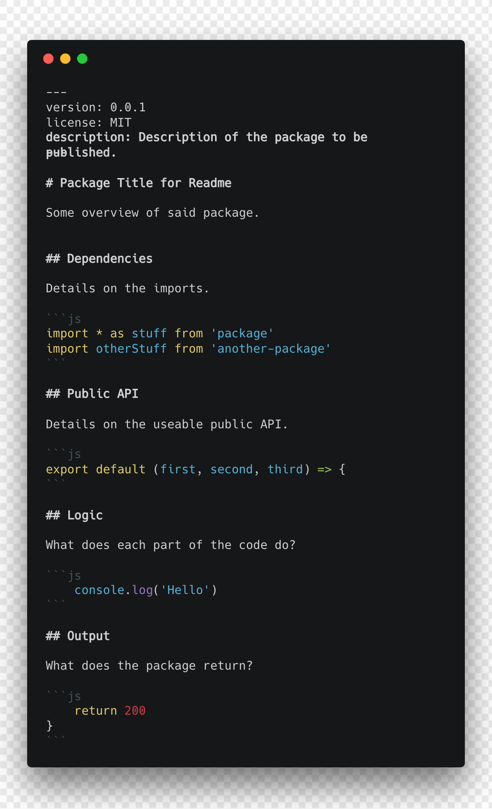

# Entyre

[**Entyre**](https://github.com/RayBenefield/dev-xp/tree/master/src/node_modules/entyre)
is built around the concept of a **Single File Package (SFP)**, inspired by
[**Vue.js**](https://vuejs.org/)'s **Single File Components**. Instead of
packages having _X_ number of javascript files, a `package.json`, a `readme.md`,
and other files for publishing, instead a package should be able to be made of a
single file. In
[**Entyre**](https://github.com/RayBenefield/dev-xp/tree/master/src/node_modules/entyre)'s
case this single file is an `index.md` (perhaps in the future a `readme.md`.

---

## NOTICE: Active Development

[**Entyre**](https://github.com/RayBenefield/dev-xp/tree/master/src/node_modules/entyre)
is still in its early stages of development. Feel free to watch this
[**project**](https://github.com/RayBenefield/dev-xp/projects/11) as it grows.

_Nothing in this project promises to be stable until we reach `v0.1.0`._

---

## Inception

Over the past few months I have decided to start working on a monorepo for ALL
of my projects. The amount of overhead to start a new project was always
massive. You could prototype and publish quickly, but for all the
[**Developer Experience**](https://hackernoon.com/developer-experience-dx-devs-are-people-too-6590d6577afe)
related stuff like compilation, formatting, githooks, publishing, changelogs,
versioning, testing, etc. it is just a painful experience. A monorepo approach
removed this problem for me. So I started working on a tool called
[**KI/KD**](https://github.com/RayBenefield/dev-xp/tree/master/src/node_modules/kikd)
inspired by [**Lerna**](https://lernajs.io/) that would serve as a monorepo tool
for an entire "company" of one developer. The goal was to be able to match
Google's monorepo approach and efficiency in providing new products to the
world.

Over time, I discovered that I was able to reduce each package into a single
`index.js` file with no `package.json` for just use in development. For
publishing though, I still needed
[**KI/KD**](https://github.com/RayBenefield/dev-xp/tree/master/src/node_modules/kikd)
to create a `package.json` to track the versioning and a `readme.md` because
publishing to NPM without a `readme.md` is dumb. While at `Vue Conf US 2018` in
New Orleans, I had come up with a cool idea to mix
[**Literate Programming**](https://en.wikipedia.org/wiki/Literate_programming)
into my build system to be able to write docs with my code because I was running
into a problem where I had 60+ potential packages, but I had no documentation
for ANY of them. One night out drinking, something clicked.
[**Vue.js**](https://vuejs.org/) Single File Components, were just a bunch of
"sections" in a single file that were marked. At that moment I realized that I
could literally make **Single File Packages** if I combined the concept of
**Front Matter** from static site generators like
[**Jekyll**](https://jekyllrb.com/) with
[**Literate Programming**](https://en.wikipedia.org/wiki/Literate_programming)
where code was in "sections" and the `package.json` was in its own "section".
And the rest is history.

---

## SFP Example

A single file is a markdown file that looks like the following:



---

## Parts

The single file is made up of several parts:

### Front Matter

This concept is borrowed from static site generators... like
[**Jekyll**](https://jekyllrb.com/). The core concept is that at the beginning
of a markdown document, one can define its metadata via yaml properties in a
fenced block. From above, this is the **Front Matter**:

```
---
version: 0.0.1
license: MIT
description: Description of the package to be published.
---
```

In
[**Entyre**](https://github.com/RayBenefield/dev-xp/tree/master/src/node_modules/entyre)
**Front Matter** is used to define the equivalent of a package's `package.json`
file. Tools working with **SFPs** will auto modify this **Front Matter** with
new versions or new dependencies. With this metadata other files could be
included, like a particular `LICENSE` file in the final compilation.

### Code Blocks

The next major piece is borrowed from
[**Literate Programming**](https://en.wikipedia.org/wiki/Literate_programming),
well a more rudimentary version of
[**Literate Programming**](https://en.wikipedia.org/wiki/Literate_programming).
The idea is that your **SFP**'s code blocks are your code interspersed within
the document. Your file is docs first, code second. This allows you to give full
context to a given package's code and it sits right next to the documentation
for it. The code will never fall out of sync, but the docs may have to be
updated here and there.
[**Entyre**](https://github.com/RayBenefield/dev-xp/tree/master/src/node_modules/entyre)
preprocesses the **SFP** and extracts all of the code blocks as the actual code
before running it through [**Babel**](https://babeljs.io/) to run the code.

### The Readme

Outside of that, the ENTIRE (get it?) file is your `readme.md` document and the
only place you work. Docs, `package.json`, and code all in one sweet place.

---

## Prior Art

Thank you to the following projects:

*   [**Literate Programming by Donald Knuth**](https://en.wikipedia.org/wiki/Literate_programming) -
    _Wonderful idea to combine docs and code to change the design experience of
    coding_
*   [**lit-node by Rich Harris**](https://github.com/Rich-Harris/lit-node) -
    _Used his compile code as a starting point_
*   [**Vue.js**](https://vuejs.org/) - _For introducing the powerful Single File
    Component concept and the amazing US Vue Conf 2018 in New Orleans_
*   [**Jekyll**](https://jekyllrb.com/) - _And other static generators for the
    concept of Front Matter_
*   [**Babel**](https://babeljs.io/) - _Thank you for an amazing transpilation
    tool_
